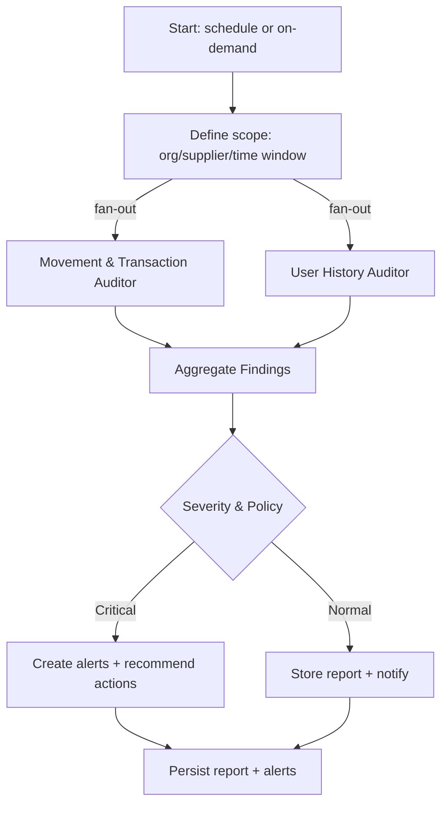

## Supervisor Report Agent (aggregator)

Generates a supervisor-friendly report by running two specialist sub-agents in parallel, then combining findings into a single summary with recommended actions.

- Movement & Transaction Auditor:
  - Cross-check `movements` and `transactions` for consistency (e.g., each movement has `txHash`; each related transaction has `movementId`/`productId`).
  - Detect anomalies: missing tx for movement, duplicate tx, suspicious sequences, long gaps between handover and tx confirmation.
  - Inputs: Firestore collections `movements`, `transactions` (scoped by org/time).

- User History Auditor:
  - Uses `lib/services/ml/user-behavior-analysis.ts::analyzeUserBehavior` over verifiers in scope.
  - Flags accounts with excessive scan rates, high suspicious/failure ratios, automation-like intervals.
  - Inputs: `verifications` (scoped by org/time), user roster.

- Aggregator & Policy:
  - Merges evidence into a unified report; computes severity; suggests actions (e.g., rate-limit user, manual QC for product flow, smart-contract enforcement gate).
  - Outputs: write to `reports` (type: `supervisor_report`) and optionally to `alerts`.

Integration points:
- Data reads via Firestore (`lib/firebase/firestore.ts`) or existing API routes for `movements`, `transactions`, `verifications`.
- Reuse `analyzeUserBehavior` from `user-behavior-analysis.ts` inside the `users` node.
- Optional: trigger `automated-agents.ts::enforceSmartContract` for critical severities after human sign-off.
